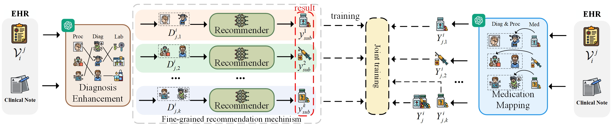

# 🧠 FineMed

<strong>Medication Mapping and Diagnosis Enhancement for Fine-grained Medication Recommendation</strong>


<p align="center">
  
</p>

------

## 🔍 Overview

**FineMed** is a fine-grained medication recommendation framework that explicitly models
**(1) diagnosis-level severity** and **(2) drug–disease correspondence**, two critical aspects that are largely overlooked in existing medication recommendation systems.

The core idea of FineMed is to decouple medication recommendation into three stages:

1. **Diagnosis Enhancement**
   Enrich each diagnosis with its associated procedures and laboratory events, providing a severity-aware disease representation.
2. **Medication Mapping**
   Infer fine-grained drug–diagnosis/procedure correspondences, enabling interpretable and disease-specific medication signals.
3. **Medication Recommendation**
   Learn patient representations over enhanced diagnoses and mapped medications using a lightweight, deployable recommender.

To support the first two stages, FineMed employs a **critique-guided LLM pipeline**, where a *Corresponder* generates structured associations and a *Checker* provides **diagnostic-level critique** to guide re-generation, rather than explicit correction.

------

## ✨ Key Features

- 🔬 **Fine-grained drug–disease modeling** beyond visit-level prescriptions
- 🧩 **Severity-aware diagnosis representation** via procedures and lab events
- 🤖 **Critique-guided LLM preprocessing** (not used at inference time)
- 📊 **Fully trainable downstream recommender**, lightweight and efficient
- 🧠 **Interpretable outputs** suitable for clinical analysis and explanation

------

## 🧰 Environment

```bash
python==3.9.18
torch==2.1.1
tqdm==4.66.1
dgl==1.1.2.cu118
scikit-learn==1.3.2
```

You can create the conda environment using:

```bash
conda env create -f environment.yml
conda activate tsp
```

------

## 📁 Datasets

FineMed is evaluated on:

- **MIMIC-III v1.4**
  A publicly available critical care EHR dataset
  👉 https://mimic.mit.edu/docs/iii/
- **SMH (private dataset)**
  SMH is a proprietary outpatient dataset collected from a tertiary hospital in China, containing high-quality longitudinal diagnosis and treatment records (integrating both Traditional Chinese Medicine and modern medicine).  

> 🔒 Due to privacy and compliance constraints, SMH is not publicly released at the moment.
> We plan to release a subset or provide an online training/validation platform after paper acceptance.

<details>
<summary><b>📄 Click to expand: a raw SMH record example (unprocessed, for reference)</b></summary>

<pre>
姓名：XXX
入院时间：20XX年02月XX日 10时39分
性别：X
出院时间：20XX年03月XX日 15时17分
年龄：XX岁
住院天数：11天

入院情况：
    患者因“阵发性胸闷、憋气3月，加重5天。”入院。
    患者3月前无明显诱因出现阵发性胸闷、憋气，
    情绪变化及活动后症状明显加重，
    体力活动明显受限，休息5–10分钟可缓解。

入院诊断：
    中医诊断：
        心衰病
            气虚血瘀证
    西医诊断：
        1. 慢性心力衰竭急性失代偿
           心功能 II 级（NYHA）
        2. 病毒性扩张型心肌病
        3. 肾病综合征

诊疗经过：
    ……

出院诊断：
    ……

出院医嘱：
    ……
</pre>

</details>

------

## 🛠️ Data Preprocessing

Once MIMIC-III is properly configured, run the following steps:

```bash
cd data

# Generate molecular SMILES features
python get_smiles.py

# Preprocess raw MIMIC-III data
python preprocess_mimic-iii.py

# Normalize diagnosis/procedure codes to standard ICD-9
python icd_process.py

# Segment clinical notes into structured sections
python segment.py
```

------

## 🧠 Diagnosis Enhancement (LLM-based)

This module enriches each diagnosis with its associated procedures and lab events.

```bash
cd diagnosis_enhancement

# Corresponder: generate diagnosis–procedure–lab associations
python corresponder.py

# Checker: provide critique-level feedback
python checker.py
```

### ⚠️ Notes on LLM Usage

- LLM outputs are **not always deterministic** and may violate format constraints.
- In our experiments, each sample typically requires **3–4 re-generation rounds**.
- The Checker **does not provide corrections**, but high-level critique guiding re-generation.

------

## 💊 Medication Mapping (LLM-based)

This module infers fine-grained correspondences between medications and the diagnoses/procedures they treat.

```bash
cd medication_mapping

# Corresponder: generate drug–diagnosis/procedure mappings
python corresponder.py

# Checker: critique mapping plausibility and structure
python checker.py
```

### ⚠️ LLM Cost Disclaimer

- The choice of LLM **significantly affects reasoning quality**.
- We recommend using **GPT-4o**.
- Total LLM cost for diagnosis enhancement and medication mapping in this work exceeded **$300 USD**.
- These labels are used for **offline preprocessing only** and are not required during model inference.

------

## 🚀 Train and Evaluate FineMed

After preprocessing and LLM-based enhancement:

```bash
# Prepare model inputs
cd data
python input_pre.py
python input_generate.py
cd ..

# Train on MIMIC-III
python main_mimic-iii.py

# Test (set resume_path to the best checkpoint)
python main_mimic-iii.py --test
```

------

## 📌 Important Remarks

- LLMs are used **only for data construction**, not during inference.
- The Checker is **not an oracle**; its feedback is heuristic and non-binding.
- All downstream models are **fully trainable without LLM access**.

------

## 📜 License

This repository is released for **research purposes only**.
Dataset usage must comply with the original licenses and data use agreements.

------

## 🙏 Acknowledgements

None.
